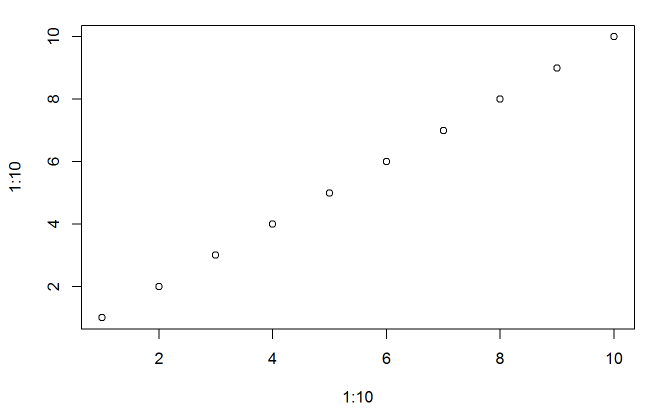

```{r setup, include=FALSE}
knitr::opts_chunk$set(echo = TRUE)
require(kableExtra)
require(broom)
```

# Introduction

Some of the analysis is backed up by [@vanderweele2019principles]. This is another citation: [@wasserman2009high].

# Methods

## Data

```{r sum, echo=FALSE}
1+4
```

I am going to use a *dataset*. The name of the dataset is **CCHS**.

* I have a list
    - The list object 1
    - The list object 2
* I have another list

I have a [link](https://www.ubc.ca).

```{r plot, echo = FALSE}
plot(1:10,1:10)
```


```{r plotsaved, echo=FALSE, out.width='100%'}

```


```{r table, echo=FALSE}
kable(head(airquality))
```

```{r mode, echo=FALSE}
fit <- lm(Ozone~Month+Day, data=airquality)
kable(tidy(fit), digits = 2)
```


## Statistical analysis

# Results

# Discussion

# Web-appendix

# Reference