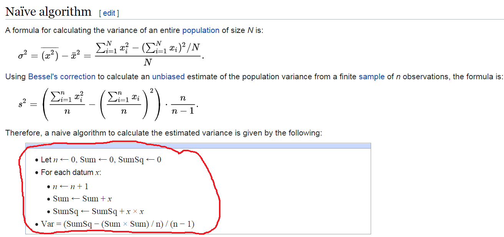

# Problem

Use the functions we learned in Lab 1 to complete Lab 1 Exercise. We will use Right Heart Catheterization Dataset saved in the folder named 'Data/wrangling/'. The variable list and description can be accessed from [Vanderbilt Biostatistics website](https://biostat.app.vumc.org/wiki/pub/Main/DataSets/rhc.html).

A paper you can access the original table from [this paper](https://jamanetwork-com.ezproxy.library.ubc.ca/journals/jama/fullarticle/407990) ([doi: 10.1001/jama.1996.03540110043030](https://pubmed.ncbi.nlm.nih.gov/8782638/)). We have modified the table and corrected some issues. Before you start, please knit your file at least once and check whether a pdf file is created. Once you finished, please knit your file and submit the knitted pdf (recommended) or word file **ONLY**.

```{r setup, message=F, warning=F}
# Load required packages
library(dplyr)
library(tableone)
```

```{r}
# Data import: name it rhc
#rhc <- ...("Data/wrangling/rhc.csv", ...)
```

# Problem 1: Basic Manipulation [60\%]

(I) Continuous to Categories: Change the Age variable into categories below 50, 50 to below 60, 60 to below 70, 70 to below 80, 80 and above [Hint: the `cut` function could be helpful]

```{r a1}

```

(II) Re-order: Re-order the levels of race to white, black and other

```{r a2}

```

(III) Set reference: Change the reference category for gender to Male

```{r a3}

```

(IV) Count levels: Check how many levels does the variable "cat1" (Primary disease category) have? Regroup the levels for disease categories to "ARF","CHF","MOSF","Other". [Hint: the `nlevels` and `list` functions could be helpful]

```{r a4}

```

(V) Rename levels: Rename the levels of "ca" (Cancer) to "Metastatic","None" and "Localized (Yes)", then re-order the levels to "None","Localized (Yes)" and "Metastatic"

```{r a5}

```

(VI) comorbidities:

-   Create a new variable called "numcom" to count number of comorbidities illness for each person (12 categories) [Hint: the `rowSums` command could be helpful],
-   Report maximum and minimum values of numcom:

```{r a6}
# See head of comorbidities
# head(rhc[,c("cardiohx", "chfhx", "dementhx", "psychhx", "chrpulhx", "renalhx", 
#             "liverhx", "gibledhx", "malighx", "immunhx", "transhx", "amihx")])

# your codes here

```

(VII) Anlaytic data: Create a dataset that has only the following variables

-   age, sex, race, cat1, ca, dnr1, aps1, surv2md1, numcom, adld3p, das2d3pc, temp1, hrt1, meanbp1, resp1, wblc1, pafi1, paco21, ph1, crea1, alb1, scoma1, swang1

-   name the dataset as rhc2

```{r a7}

```

# Problem 2: Table 1 [10\%]

Re-produce the sample table 1 from the rhc2 data (see the Table below). In your table, the variables should be ordered as the same as the sample. Please re-level or re-order the levels if needed. [Hint: the `tableone` package might be useful]

|                      | No RHC          | RHC             |
| -------------------- | --------------- | --------------- |
| n                    | 3551            | 2184            |
| age (%)              |                 |                 |
|    [-Inf,50)         |    884 (24.9)   |    540 (24.7)   |
|    [50,60)           |    546 (15.4)   |    371 (17.0)   |
|    [60,70)           |    812 (22.9)   |    577 (26.4)   |
|    [70,80)           |    809 (22.8)   |    529 (24.2)   |
|    [80, Inf)         |    500 (14.1)   |    167 ( 7.6)   |
| sex = Female (%)     |   1637 (46.1)   |    906 (41.5)   |
| race (%)             |                 |                 |
|    white             |   2753 (77.5)   |   1707 (78.2)   |
|    black             |    585 (16.5)   |    335 (15.3)   |
|    other             |    213 ( 6.0)   |    142 ( 6.5)   |
| cat1 (%)             |                 |                 |
|    ARF               |   1581 (44.5)   |    909 (41.6)   |
|    CHF               |    247 ( 7.0)   |    209 ( 9.6)   |
|    Other             |    955 (26.9)   |    208 ( 9.5)   |
|    MOSF              |    768 (21.6)   |    858 (39.3)   |
| ca (%)               |                 |                 |
|    None              |   2652 (74.7)   |   1727 (79.1)   |
|    Localized (Yes)   |    638 (18.0)   |    334 (15.3)   |
|    Metastatic        |    261 ( 7.4)   |    123 ( 5.6)   |
| dnr1 = Yes (%)       |    499 (14.1)   |    155 ( 7.1)   |
| aps1 (mean (SD))     |  50.93 (18.81)  |  60.74 (20.27)  |
| surv2md1 (mean (SD)) |   0.61 (0.19)   |   0.57 (0.20)   |
| numcom (mean (SD))   |   1.52 (1.17)   |   1.48 (1.13)   |
| adld3p (mean (SD))   |   1.24 (1.86)   |   1.02 (1.69)   |
| das2d3pc (mean (SD)) |  20.37 (5.48)   |  20.70 (5.03)   |
| temp1 (mean (SD))    |  37.63 (1.74)   |  37.59 (1.83)   |
| hrt1 (mean (SD))     | 112.87 (40.94)  | 118.93 (41.47)  |
| meanbp1 (mean (SD))  |  84.87 (38.87)  |  68.20 (34.24)  |
| resp1 (mean (SD))    |  28.98 (13.95)  |  26.65 (14.17)  |
| wblc1 (mean (SD))    |  15.26 (11.41)  |  16.27 (12.55)  |
| pafi1 (mean (SD))    | 240.63 (116.66) | 192.43 (105.54) |
| paco21 (mean (SD))   |  39.95 (14.24)  |  36.79 (10.97)  |
| ph1 (mean (SD))      |   7.39 (0.11)   |   7.38 (0.11)   |
| crea1 (mean (SD))    |   1.92 (2.03)   |   2.47 (2.05)   |
| alb1 (mean (SD))     |   3.16 (0.67)   |   2.98 (0.93)   |
| scoma1 (mean (SD))   |  22.25 (31.37)  |  18.97 (28.26)  |

```{r b1}

```

# Problem 3: Table 1 for subset [10\%] 

Produce a similar table as Problem 2 but with only male sex and ARF primary disease category (cat1). Add the overall column in the same table. [Hint: `filter` command could be useful]

```{r c1}

```

# Problem 4: Considering eligibility criteria [20\%]

Produce a similar table as Problem 2 but only for the subjects who meet all of the following eligibility criteria: (i) age is equal to or above 50, (ii) age is below 80 (iii) Glasgow Coma Score is below 61 and (iv) Primary disease categories are either ARF or MOSF. [Hint: `droplevels.data.frame` can be a useful function]

```{r d1}

```

# Optional [0\%]

## Optional 1: Missing values

(I) Any variables included in rhc2 data had missing values? Name that variable. [Hint: `apply` function could be helpful]

```{r o11}

```

(II) Count how many NAs does that variable have?

```{r o12}

```

(III) Produce a table 1 for a complete case data (no missing observations) stratified by `swang1`.

```{r o13}

```

## Optional 2: Calculating variance of a sample

Write a `function` for Bessel's correction to calculate an unbiased estimate of the population variance from a finite sample (a vector of 100 observations, consisting of numbers from 1 to 100).

```{r o21}
Vector <- 1:100

#variance.est <- function(?){?}

#variance.est(Vector)
```

Hint: Take a closer look at the functions, loops and algorithms shown in lab materials. Use a `for loop`, utilizing the following pseudocode of the [algorithm](https://en.wikipedia.org/wiki/Algorithms_for_calculating_variance):

```{r o22, echo=FALSE, out.width = '90%'}

```

Verify that estimated variance with the following variance function output in R:

```{r o23}
var(Vector)
```

# Knit your file

Please knit your file once you finished and submit the knitted PDF or doc file. Please also fill-up the following table:

**Group name**: \*\* xyz \*\*

| Student initial   | \% contribution |
|:------------------|:----------------|
| Student 1 initial | x%              |
| Student 2 initial | x%              |
| Student 3 initial | x%              |
